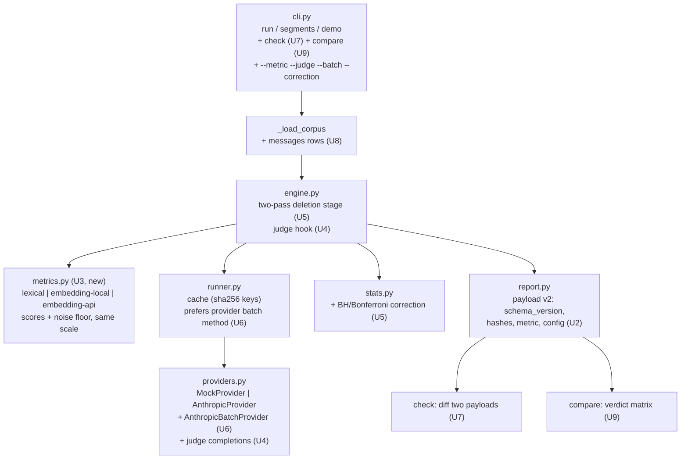
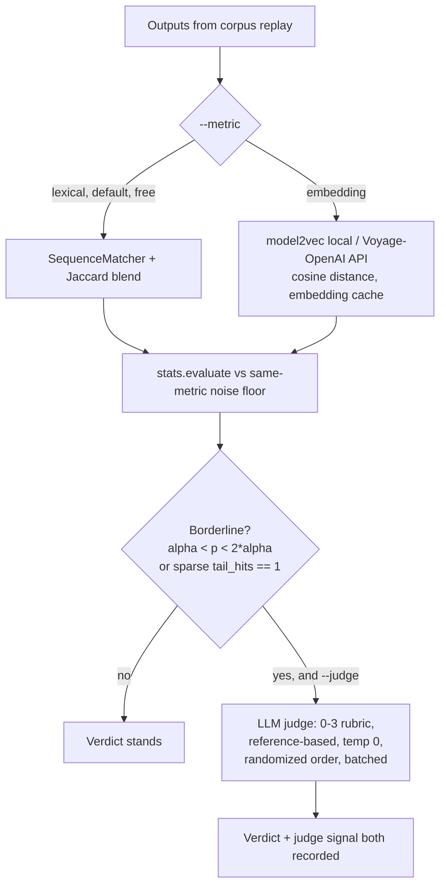
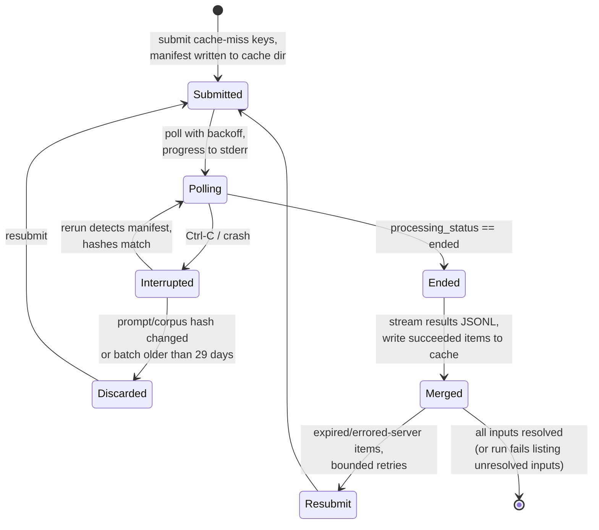
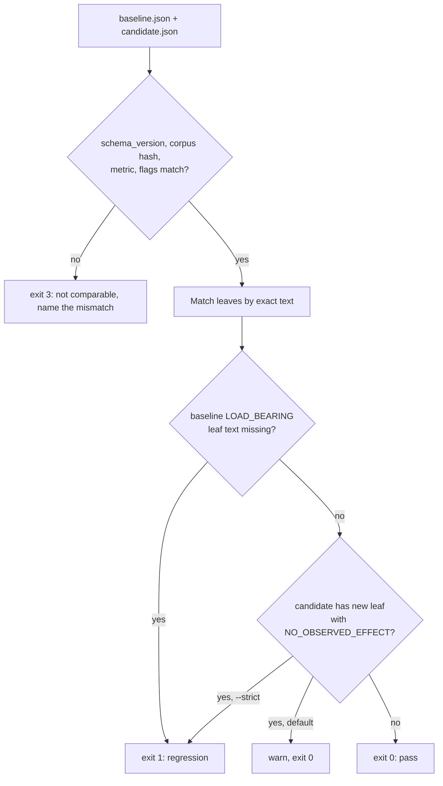

# feat: promptcov v0.2 — roadmap features, statistical hardening, and project infrastructure

**Target repo:** `promptcov` (the inner package directory; all paths below are relative to it). The directory is not yet a git repository — U1 establishes that.

## Summary

Implement all five README roadmap items — pluggable embedding/LLM-judge divergence metrics, an Anthropic Message Batches backend, a CI mode (`promptcov check`), teacher-forced multi-turn replay, and cross-model comparison reports — plus statistical hardening drawn from the README's own Limitations section (Benjamini-Hochberg correction, probe power) and project infrastructure the repo lacks (git, CI, packaging hygiene). The zero-hard-dependency philosophy is preserved throughout: everything heavy lands behind optional extras with lazy imports.

---

## Problem Frame

promptcov v0.1.0 is feature-complete for single-turn, lexical-metric, synchronous analysis: it ablates prompt segments, replays a traffic corpus, and statistically classifies each rule against a noise floor. Its own README names the boundaries: the divergence metric is purely lexical (misses semantic-only shifts, over-weights rephrasings), runs cost full API price, there is no way to gate prompt edits in CI, multi-turn traces cannot be replayed, and a rule's verdict on one model says nothing about another. Separately, every segment is tested at raw alpha with no multiple-comparisons correction, and probe verdicts rest on a 4-input, 2-replicate null. The project also has no git history, no CI, and generated artifacts sitting untracked in the repo root.

Research confirmed no existing tool duplicates promptcov's statistical noise-floor ablation core (promptfoo is the closest CI precedent but does whole-prompt eval, not segment ablation) — so the work below extends a differentiated design rather than converging on prior art.

---

## Requirements

**Payload contract**
- R1. The report JSON carries `schema_version`, prompt and corpus content hashes, the metric identity (name, model, dimensions where applicable), and the full run configuration, so downstream consumers can validate comparability preconditions.

**Divergence metrics**
- R2. A metric is selectable via `--metric` (default `lexical`); the chosen metric produces both the variant scores and the noise floor, on the same scale, and is stamped into the payload.
- R3. An embedding metric works fully offline via an optional `promptcov[embeddings]` extra (model2vec/potion, numpy-only dependency chain), with an API-embedding alternative (Voyage, OpenAI-compatible) callable through the existing raw-HTTP style. Missing extras or keys fail at startup with actionable messages.
- R4. An opt-in LLM-judge stage re-scores only borderline segments using a reference-based coarse rubric; judge inputs/outputs are recorded per segment and never silently overwrite the metric verdict.

**Batches backend**
- R5. `--batch` runs the batchable engine stages through the Anthropic Message Batches API (50% discount), reassembling results by `custom_id`, with per-item error handling and bounded resubmission of expired items.
- R6. An interrupted batch run (Ctrl-C, crash) resumes from persisted batch state without resubmitting completed work; stale state (changed prompt/corpus, >29-day-old batches) is detected and discarded.

**CI mode**
- R7. `promptcov check` compares a candidate report against a committed baseline report and exits nonzero when a baseline `LOAD_BEARING` segment is deleted; new `NO_OBSERVED_EFFECT` rules warn by default and fail under `--strict`.
- R8. Segments are matched across prompt edits by leaf text, not structural ID. A baseline `LOAD_BEARING` leaf whose text is absent from the candidate always fails (fail-closed: deletion and rewording are indistinguishable by text; the failure message notes that a rewording is cleared by regenerating the baseline). New unmatched candidate text is reported as unknown; `INHERITED`/`NOT_TESTED` verdicts are treated as unknown, not as dead.
- R9. Exit codes distinguish pass (0), policy failure (1), and infra/usage failure (3); comparability-precondition mismatches (different corpus hash, metric, schema, or any verdict-affecting config field recorded under R1) are hard errors.

**Multi-turn replay**
- R10. The corpus accepts `{"messages": [...]}` rows; replay regenerates the final assistant turn under each ablated prompt (one divergence score per row). Mixed single/multi-turn corpora are valid; invalid row shapes fail with location-prefixed errors in the existing `_load_corpus` style.

**Cross-model comparison**
- R11. `promptcov compare` produces a verdict-level cross-model report (e.g. load-bearing on model A, no observed effect on model B), each verdict derived against its own model's noise floor, with input-identity and config-parity preconditions enforced via the R1 hashes.

**Statistical hardening**
- R12. Each leaf's deciding deletion p-value (combining the dense permutation and sparse binomial channels) receives Benjamini-Hochberg correction by default (`--correction bh|bonferroni|none`, q=0.10); reports show raw p and adjusted q side by side plus the number of tests.
- R13. Probe power is improved (configurable probe replicates, higher floor) and probe-based verdicts carry an explicit power caveat.

**Infrastructure**
- R14. The project is a git repository with a `.gitignore` covering build artifacts, caches, venvs, and generated reports, and a GitHub Actions workflow running the test suite on supported Python versions.
- R15. The demo, all existing tests, and the offline mock path continue to work unchanged; every new feature is exercisable offline through the mock provider or recorded fixtures.

---

## Key Technical Decisions

- **Payload contract first.** `schema_version`, content hashes, and metric identity land in U2 before any comparing feature, because `check` (U7) and `compare` (U9) cannot validate their own preconditions without them, and the metric field (U3) must be recorded from the moment metrics become pluggable. Reports missing `schema_version` are treated as legacy and hard-error in `check`.
- **Metric = pluggable pairwise scorer; judge = confirmation stage.** A metric is a `score(a, b) -> float` implementation registered by name that supplies *both* variant scores and the noise floor — the stats layer compares them directly, so mixing scales is invalid by construction. The LLM judge is deliberately *not* a metric: it is a second opinion applied to a deterministic borderline band (`alpha < p < 2*alpha`, or sparse `tail_hits == 1`), recorded alongside the metric's verdict.
- **Local embeddings via model2vec (`potion-base-32M`).** Research: ~30 MB model, numpy-only dependency, MIT, tens of thousands of sentences/sec on CPU — the only option compatible with the zero-hard-dependency philosophy (sentence-transformers pulls PyTorch; FastEmbed pulls a 100+ MB onnxruntime wheel). API alternative defaults to Voyage `voyage-4-lite` ($0.02/M, 200M free tokens, Anthropic's documented embeddings partner) with an OpenAI-compatible fallback, both via the existing raw-HTTP pattern. Anthropic has no embeddings endpoint — do not wait for one. Static embeddings are order-insensitive, which is why they complement rather than replace the lexical metric.
- **Per-metric calibration constants.** `MIN_EFFECT = 0.02` and the prune-verify margins are calibrated to the lexical scale; each metric declares its own `min_effect` default and a `sparse_margin` (replacing the hardcoded 0.01 floors in `stats.evaluate` and prune-verify, which are absolute rather than noise-floor-relative), and the noise-floor-relative tests carry the rest. CLI `--min-effect` becomes a `None`-sentinel default resolved to the selected metric's registered value, so an explicit user override still wins.
- **Benjamini-Hochberg at q=0.10, deletion stage only, two-pass, on the deciding p.** Correction *reduces* the number of `LOAD_BEARING` flags, which is the risky direction for a prompt-trimming tool — so BH (power-preserving) beats Bonferroni, and the default q is the permissive 0.10. Because each deletion verdict can become significant via either the dense permutation p or the sparse binomial tail p, the corrected quantity is the per-leaf *deciding* p: `min(p_dense, p_sparse)` doubled (factor-2 Bonferroni for the two channels, capped at 1.0), fed into BH across leaves — correcting only the dense channel would leave the sparse "cheese rule" path uncorrected. Applying it requires restructuring the deletion stage into collect-all-p-values-then-decide; the sequential negate/probe cascade stays per-leaf and uncorrected (each is a follow-up test on an already-insignificant deletion, a different hypothesis family).
- **Batch backend as an optional provider capability.** Following the existing `hasattr` duck-typing convention (`negate_rule`, `generate_probes`), a provider may expose a batch-completion method that `Runner.batch` prefers when present, submitting only cache-miss keys. `custom_id` = the existing sha256 cache key (64 hex chars, exactly the Batches limit), with the cache-miss set deduplicated before submission (duplicate corpus rows share a key). Batch submissions aggregate independent requests per engine phase — all baseline replicates in one batch, the section sweep in one, each recursion frontier's leaf sweep in one (leveraging U5's collect-then-decide restructure), verification in one — a deliberate engine control-flow change, because batching within each sequential `runner.batch` call would serialize dozens of polled batches with no latency floor. Negation/probe generation (`_small`) and the serial greedy rescue loop (including its verify sweeps) bypass batching via synchronous `complete()`. Requests carry `cache_control` with the 1-hour TTL on the shared ablated-prompt prefix — the batch discount and prompt caching stack.
- **`check` diffs two stored JSONs by default.** No API calls, no keys in CI, no statistical flakiness from fresh runs — the promptfoo-validated model of cached baselines. Regressions are judged by direction against the *baseline's* verdicts (baseline `LOAD_BEARING` leaf text absent from candidate), not by re-derived significance. A `--run` convenience mode that produces the candidate report first is orchestration sugar over the same comparison. A `--prompt FILE` freshness gate hashes the working-tree prompt file and exits 3 when it does not match the candidate's `prompt_sha256`, so a stale committed candidate report cannot pass the gate vacuously — CI invocations should always pass it.
- **Multi-turn v1 is final-turn-only.** One regenerated turn per row keeps one score per row, so the entire stats layer (pairing, noise floor, sparse binomial) is untouched. Per-turn teacher forcing (T scores per row, aggregation questions) is explicitly deferred. Message lists serialize canonically (sorted keys, fixed separators) for cache keys; rows containing a `system` role are rejected (it would collide with the ablated system prompt under test).
- **Cross-model comparison is verdict-level only.** Each model has its own noise floor and style distribution; raw effect sizes are not comparable across models and the report says so explicitly. `compare` supports both orchestration (run A, run B, compare) and two-stored-reports mode; the latter hard-errors on prompt/corpus-hash or config-parity mismatches.
- **Judge model default `claude-haiku-4-5`, temperature 0, pinned in the payload.** Judging is a high-volume confirmation pass where cost dominates; the model is configurable (`--judge-model`) and judge calls flow through the Runner cache and, when `--batch` is active, through the Batches API.
- **Everything stays offline-testable.** New capability follows the established pattern: lazy imports inside classes, optional extras in `pyproject.toml`, deterministic seeded behavior, and mock/fixture paths so the test suite and demo never need a network.

---

## High-Level Technical Design

### Component seams (what changes where)

### Metric cascade (cost-ordered)

### Batch run lifecycle (U6 resume state machine)

### `check` decision flow (U7)

---

## Implementation Units

### U1. Project infrastructure: git, gitignore, CI

- **Goal:** Make the project a version-controlled repository with automated tests, so every subsequent unit lands as a reviewable commit.
- **Requirements:** R14, R15
- **Dependencies:** none
- **Files:** `.gitignore` (new), `.github/workflows/ci.yml` (new), `pyproject.toml` (dev extra: pytest)
- **Approach:** `git init` with an initial commit of the current v0.1.0 state. `.gitignore` covers `build/`, `*.egg-info/`, `.venv/`, `__pycache__/`, `.pytest_cache/`, `.promptcov_cache/`, `uv.lock` decision (keep it — it pins the optional httpx chain), and the generated `aria_report.html`, `aria_report.json`, `aria_pruned.md`. CI workflow: matrix over Python 3.10 and the latest stable, `pip install -e '.[dev]'`, `pytest -q`, plus a `promptcov demo` smoke step (offline by design).
- **Patterns to follow:** none in-repo yet; keep the workflow minimal (no lint gate in this unit — the codebase has no configured linter and retrofitting one is out of scope).
- **Test scenarios:** Test expectation: none — repository/CI configuration; the CI run itself executing the existing 13 tests plus the demo smoke step is the verification.
- **Verification:** `git status` clean after a demo run (generated artifacts ignored); the Actions workflow passes on a pushed branch.

### U2. Payload contract v2

- **Goal:** Version the report JSON and record everything downstream comparison needs: schema version, content hashes, metric identity, full run config.
- **Requirements:** R1
- **Dependencies:** U1
- **Files:** `promptcov/report.py`, `promptcov/engine.py` (Results/meta plumbing), `promptcov/cli.py`, `tests/test_promptcov.py`
- **Approach:** Add to `payload()['meta']`: `schema_version` (start at 2), `prompt_sha256`, `corpus_sha256` (hash of canonicalized rows), `metric` (name; model/dimensions once U3 lands), and the full config (`replicates`, `alpha`, `min_effect`, `negate`, `probes`, `exhaustive`, `temperature`, `max_tokens`, `probe_n`). Keep `generated`/`seconds`/`provider_calls` but document them as non-comparable fields. Fix the corpus-loader's silent fallback: a line that parses as JSON but is a dict without a recognized key is already an error; a line that *almost* parses (starts with `{`) but fails `json.loads` should error rather than silently become plain text — this is the flow-analysis bug worth fixing while touching the loader.
- **Patterns to follow:** `report.py:_payload` single-source pattern (JSON and HTML embed come from one dict); `_load_corpus`'s location-prefixed `SystemExit` error style.
- **Test scenarios:**
  - Happy path: demo run payload contains `schema_version == 2`, 64-char hex prompt/corpus hashes, and every config field with the values passed on the CLI.
  - Determinism: two runs over the same prompt+corpus produce identical `prompt_sha256`/`corpus_sha256`.
  - Edge: corpus line `{"input": "x"` (truncated JSON) exits with a location-prefixed error instead of being treated as literal text.
  - Compatibility: existing pinned-verdict tests still pass (payload additions only, no renames).
- **Verification:** `aria_report.json` from `promptcov demo` validates against the new field list; no existing test modified except additively.

### U3. Pluggable metric interface + embedding backends

- **Goal:** Make the divergence metric selectable, add a local embedding metric behind `promptcov[embeddings]`, and an API embedding metric via raw HTTP — each supplying scores and noise floor on its own scale.
- **Requirements:** R2, R3
- **Dependencies:** U2 (metric stamped into payload)
- **Files:** `promptcov/metrics.py` (new), `promptcov/divergence.py` (becomes the lexical implementation), `promptcov/engine.py` (metric threaded through `_variant_scores`, the two noise-floor sites — baseline pairwise noise and probe noise — and `Config`), `promptcov/cli.py` (`--metric`, `--embedding-model`, `--embedding-api`), `pyproject.toml` (`embeddings = ["model2vec"]` extra), `tests/test_promptcov.py`
- **Approach:** `metrics.py` holds a small registry mapping names to scorer objects with `score(a, b) -> float` in [0,1], a `name` (recorded in `meta.metric`), a `default_min_effect`, and a `sparse_margin` (0.01 for lexical — replaces the two hardcoded floors). The CLI's `--min-effect` default becomes a `None` sentinel resolved to the selected metric's `default_min_effect` when building `Config` (0.02 stays the lexical metric's registered value, so default behavior is unchanged). Lexical wraps the existing `divergence()` unchanged. `EmbeddingMetric` lazily imports model2vec inside `__init__` (default model `potion-base-32M`, downloaded/cached on first use) and computes cosine distance; the API variant posts to Voyage (`voyage-4-lite` default) or an OpenAI-compatible endpoint using the same httpx raw-HTTP style as `AnthropicProvider`, keyed by `VOYAGE_API_KEY`/`OPENAI_API_KEY`. Embeddings get their own append-only cache file in the cache dir keyed by `(embedding_model, sha256(text))` — without it every output is re-embedded against every baseline replicate, which for API embeddings silently bills on "free" cached reruns. Missing extra → actionable `SystemExit` ("pip install 'promptcov[embeddings]'"); missing key → `RuntimeError` at startup, before any completion calls, matching `AnthropicProvider.__init__`.
- **Patterns to follow:** lazy imports inside class `__init__` (see `AnthropicProvider`); `Runner`'s JSONL append-only cache with torn-write tolerance; `hasattr`-style optionality; per-module prose docstring.
- **Test scenarios:**
  - Happy path: `--metric lexical` produces byte-identical results to v0.1.0 on the demo (regression pin).
  - Same-scale invariant: with a stub metric registered in-test, the engine's noise floor and variant scores both flow through the stub (assert call counts / sentinel values) — no code path mixes metrics.
  - Edge: `--metric embedding` without the extra installed exits with the install hint, before any provider call (`Runner.calls == 0`).
  - Edge: API embedding metric with unset key exits at startup with the env-var name in the message.
  - Embedding cache: second scoring pass over identical texts performs zero new embedding computations (counting stub).
  - Per-metric defaults: registered `default_min_effect` reaches `stats.evaluate` unless `--min-effect` overrides.
- **Verification:** demo passes under `--metric lexical`; an offline stub-embedding run completes end-to-end and stamps `meta.metric` correctly.

### U4. LLM-judge confirmation stage

- **Goal:** Re-score borderline segments with a reference-based LLM judge, recording its signal without overwriting the metric verdict.
- **Requirements:** R4
- **Dependencies:** U3 (borderline band defined against metric results), U2 (payload fields)
- **Files:** `promptcov/judge.py` (new), `promptcov/engine.py` (`_test_leaf` hook), `promptcov/providers.py` (judge completion path), `promptcov/report.py` (per-segment judge fields), `promptcov/cli.py` (`--judge`, `--judge-model`), `tests/test_promptcov.py`
- **Approach:** Borderline is deterministic, documented, and symmetric around the decision boundary — so both downgrades of near-threshold `LOAD_BEARING` verdicts and upgrades of near-misses are reachable: `alpha/2 < p < 2*alpha` on the deciding test, dense-significant leaves whose effect is below `2 * min_effect`, or sparse results with `tail_hits` in {1, 2}. For each borderline segment, sample a bounded subset of inputs and ask the judge to rate baseline-vs-variant pairs on a 0–3 rubric (identical / stylistic-only / minor substantive / materially different), justification before score, temperature 0, pair order randomized per item (seeded). Judge calls go through the Runner cache with a run tag embedding the judge model and temperature (e.g. `judge-{model}-t0`) — so swapping `--judge-model` (default `claude-haiku-4-5`) on a warm cache triggers fresh judge calls rather than silently reusing another model's scores. The judge outcome adjusts the verdict only in the documented direction table (e.g. borderline `LOAD_BEARING` + judge-says-stylistic → downgraded, with both signals in the segment note); payload gains `judge: {model, band, mean_score, n_pairs, verdict_effect}` per judged segment and `judged: false` elsewhere. `estimate_calls` gains a judge term so `--dry-run` doesn't lie.
- **Patterns to follow:** `_small`-style bounded completions in `AnthropicProvider`; seeded determinism (`stats.permutation_test(seed=7)` precedent); verdict notes as human-readable strings (`SegmentVerdict.note`).
- **Test scenarios:**
  - Happy path: a mock judge provider returning fixed scores flips a borderline verdict per the direction table, and the payload carries both the original signal and the judge block.
  - Determinism: two runs with the same seed judge the same segments in the same pair order.
  - Boundary: segments with `p < alpha/2` and effect `>= 2*min_effect`, or with `p > 2*alpha` and no sparse near-miss, are never judged (assert judge call count).
  - Caching: rerun with warm cache makes zero new judge calls; changing `--judge-model` on a warm cache produces new judge calls.
  - Dry run: `--dry-run --judge` includes the judge-call term in the estimate.
  - Error path: judge completion failure degrades to "judge unavailable" in the note; the metric verdict stands.
- **Verification:** offline run with a scripted judge double produces a report where judged segments visibly carry both signals in the HTML/JSON.

### U5. Statistical hardening: multiple-comparisons correction + probe power

- **Goal:** Correct deletion-stage p-values for multiple testing and strengthen the probe path's null.
- **Requirements:** R12, R13
- **Dependencies:** U2 (config in payload); independent of U3/U4
- **Files:** `promptcov/stats.py` (BH/Bonferroni functions, `TestResult` adjusted-q field), `promptcov/engine.py` (deletion stage restructured to two-pass), `promptcov/cli.py` (`--correction`, `--q`, `--probe-replicates`), `promptcov/report.py` (raw p + q + m surfaced), `tests/test_promptcov.py`
- **Approach:** Restructure the leaf deletion stage into collect-then-decide: run all leaf deletion tests within the recursion frontier, compute each leaf's deciding p-value — `min(p_dense, p_sparse)` doubled per leaf (factor-2 Bonferroni for the two channels, capped at 1.0) — apply the selected correction across those deciding p-values (BH default at q=0.10), then assign verdicts and proceed to the per-leaf negate/probe cascade only for leaves whose *corrected* deletion result is insignificant. Section-level recursion gating keeps using raw p (it is a search heuristic, not a reported claim) — document this asymmetry in the module docstring. `TestResult.summary()` gains `q` and the payload gains `meta.correction` and `meta.n_tests`. Probe power: promote the hardcoded 2 probe replicates to `--probe-replicates` (default 3), and add a standing caveat string on `UNEXERCISED` verdicts referencing `probe_n`. Update `estimate_calls` for the extra probe replicates.
- **Execution note:** Start with a characterization test pinning current demo verdicts, then verify which (if any) flip under BH *and* under the probe-replicate default change (2 → 3, which multiplies probe-noise pairs) — the demo's effects are large, so expected outcome is no flips; if one flips, that is a finding to surface, not silently absorb.
- **Patterns to follow:** `stats.py`'s dependency-free, docstring-explained functions; existing `evaluate` guard style (empty noise never significant).
- **Test scenarios:**
  - Unit: BH on a known p-value vector reproduces the textbook adjusted values; Bonferroni likewise; `none` passes raw values through.
  - Direction: with m simulated null leaves plus one strong effect, BH retains the strong effect while raw-alpha testing flags extra false positives (seeded simulation).
  - Integration: demo verdicts under `--correction bh` (expected unchanged) and under `--correction none` match v0.1.0 exactly.
  - Probe power: `--probe-replicates 4` produces the expected probe-noise pair count and updates the dry-run estimate.
  - Sparse under BH: a fixture leaf that is sparse-significant only (dense p high, binomial tail p low) survives or falls under BH exactly according to its corrected deciding p — the sparse channel does not escape correction.
  - Report: payload shows `p`, `q`, `meta.n_tests`, `meta.correction` for tested leaves.
- **Verification:** demo passes; a seeded many-null-leaves fixture demonstrates the false-positive reduction claim quantitatively.

### U6. Anthropic Message Batches backend

- **Goal:** Run the corpus-sweep stages through the Batches API at 50% cost, with resumable state.
- **Requirements:** R5, R6
- **Dependencies:** U2 (prompt/corpus hashes used in the resume manifest)
- **Files:** `promptcov/providers.py` (batch submission/poll/retrieve on the Anthropic provider), `promptcov/runner.py` (`batch()` prefers a provider batch method for deduplicated cache-miss keys), `promptcov/engine.py` (phase-aggregated submission: baseline replicates, section sweep, per-frontier leaf sweeps, and verification each submit as one batch), `promptcov/cli.py` (`--batch`, `--no-wait`), `tests/test_promptcov.py`
- **Approach:** `AnthropicProvider` (under `--batch`) gains a batch method: for the deduplicated cache-miss subset of a phase's aggregated requests (baseline replicates together, the section sweep together, each recursion frontier's leaf sweep together, verification together — the engine groups these rather than submitting per `runner.batch` call, to avoid serializing dozens of polled batches), POST `/v1/messages/batches` with one request per unique key, `custom_id` = the existing sha256 cache key, `cache_control` with 1-hour TTL on the shared system prefix; poll `GET /v1/messages/batches/{id}` with backoff and stderr progress (counts by result type); on `ended`, stream the results JSONL and write `succeeded` items into the Runner cache keyed by `custom_id`. Per-item handling: `errored` with invalid-request → fail fast naming the input; `errored` server-side and `expired` → resubmit in a follow-up batch, bounded (2 resubmits), after which the run fails listing unresolved inputs — never silently dropping inputs from paired statistics. A manifest JSONL in the cache dir records `{batch_id, stage_tag, prompt_sha256, corpus_sha256, pending_custom_ids}`; on startup with `--batch`, non-terminal manifest entries whose hashes match are polled and merged before new submission; mismatched or >29-day entries are discarded with a notice. Synchronous paths (negation/probe generation, greedy rescue including its verify sweeps, and any stage with fewer inputs than a `--batch-min` threshold) keep using `complete()`. `estimate_calls`/dry-run splits batchable vs sync calls so the discount is visible.
- **Patterns to follow:** `_post` retry ladder and status-code handling; `Runner`'s append-only JSONL + `threading.Lock`; `name`-based cache namespacing — the batch path must reuse the *same* provider name so batch and sync runs share a cache namespace.
- **Test scenarios:**
  - Happy path: a fake batch provider double (submit returns an id; poll sequence in_progress→ended; results JSONL fixture) completes a run and every output lands in the cache under its custom_id, in scrambled result order.
  - Cache sharing: outputs cached by a batch run are hits for a subsequent non-batch run of the same model/settings.
  - Resume: kill after submit (simulated), rerun finds the manifest, polls, merges, and makes zero duplicate submissions.
  - Stale state: manifest with a different `prompt_sha256` is discarded and resubmitted; a manifest entry older than 29 days likewise.
  - Per-item errors: an `expired` item is resubmitted once and succeeds; an invalid-request `errored` item fails the run naming the offending input; three consecutive expirations fail the run listing unresolved inputs.
  - Duplicate rows: a corpus containing a repeated row submits one request per unique key and fans the cached result back to every occurrence.
  - Dry run: `--dry-run --batch` shows the batch/sync split.
- **Verification:** full offline run against the fake batch provider matches the synchronous run's verdicts byte-for-byte (same cache keys, same outputs), with the number of batch submissions equal to the number of engine phases, not the number of `runner.batch` calls.

### U7. CI mode: `promptcov check`

- **Goal:** Fail builds that delete load-bearing prompt text, on stored reports, with CI-grade exit-code semantics.
- **Requirements:** R7, R8, R9
- **Dependencies:** U2 (schema/hashes/config in payload)
- **Files:** `promptcov/check.py` (new), `promptcov/cli.py` (`check` subcommand: `check BASELINE CANDIDATE`, `--strict`, `--run` convenience), `tests/test_promptcov.py`
- **Approach:** Load both payloads; hard-error (exit 3) on: missing/older `schema_version`, corpus-hash mismatch, metric mismatch, or a mismatch in any verdict-affecting config field recorded by R1 (`alpha`, `min_effect`, `correction`, `q`, `replicates`, `probe_n`, `probe_replicates`, `negate`, `probes`, `exhaustive`, judge enabled + model); prompt hashes are expected to differ (that is the point), but with `--prompt FILE` the candidate's `prompt_sha256` must match the working-tree file or `check` exits 3 with a stale-candidate message. Match leaves by exact byte text within the candidate (duplicate texts match by multiset). Regression = baseline `LOAD_BEARING` leaf text absent from candidate → exit 1 (fail-closed) listing each lost rule with its baseline effect and a note that a rewording is cleared by regenerating the baseline. Candidate leaves absent from baseline with verdict `NO_OBSERVED_EFFECT` → warning (exit 0) by default, exit 1 under `--strict`. `INHERITED`/`NOT_TESTED` on either side → "unknown", reported but never failing. New candidate text matching no baseline leaf surfaces in an "unmatched new text" section as unknown. Human-readable summary to stderr in the `●`/`▸` house style; machine-readable outcome appended to stdout as JSON when `--json` is passed. Avoid exit code 2 (argparse owns it).
- **Patterns to follow:** `main(["check", ...])` self-recursion pattern used by `demo`; `_load_corpus` error-message style; stderr/stdout separation convention.
- **Test scenarios:**
  - Pass: baseline vs candidate where a `NO_OBSERVED_EFFECT` rule was deleted → exit 0.
  - Regression: candidate missing a baseline `LOAD_BEARING` leaf → exit 1, rule text in output.
  - New dead rule: default warns exit 0; `--strict` exits 1.
  - Unknown handling: baseline `INHERITED` leaf that is `LOAD_BEARING` in candidate → reported as resolution change, exit 0.
  - Preconditions: corpus-hash mismatch → exit 3 naming both hashes; legacy payload without `schema_version` → exit 3 with an upgrade hint.
  - Duplicate texts: two identical leaves, one deleted → not a regression when the surviving one matches.
  - ID drift: same rules under shifted `S{n}.L{m}` ids still match (text-anchored).
  - Freshness: `--prompt` pointing at an edited prompt whose hash differs from the candidate payload's `prompt_sha256` → exit 3 with the stale-candidate message.
  - Run parity: `check --run` generates the candidate report and yields the same pass/fail outcome and exit code as feeding the two pre-generated reports directly.
- **Verification:** a scripted baseline/candidate pair generated from two demo runs over edited prompts exercises every exit code.

### U8. Multi-turn trace replay (teacher-forced, final turn)

- **Goal:** Replay recorded multi-turn conversations, regenerating the final assistant turn under each ablated prompt.
- **Requirements:** R10
- **Dependencies:** U2 (corpus hash must canonicalize message rows); interacts with U6 (canonical serialization feeds custom_ids) but does not depend on it
- **Files:** `promptcov/cli.py` (`_load_corpus` grammar), `promptcov/runner.py` (cache-key canonicalization), `promptcov/providers.py` (`complete` accepts a message list; `MockProvider` multi-turn awareness), `promptcov/engine.py` (inputs become an opaque corpus-row type), `promptcov/report.py` (transcript rendering in examples), `tests/test_promptcov.py`
- **Approach:** Corpus grammar: `{"input": str}` ≡ one-user-turn conversation; `{"messages": [{role, content}, ...]}` must alternate roles, start with `user`, contain only string content, contain no `system` role (rejected — collides with the prompt under test), and end with a `user` turn (a trailing assistant turn means nothing to regenerate → location-prefixed error). Mixed corpora are valid. Internally every row normalizes to a message list; cache keys hash the canonical JSON (`sort_keys`, fixed separators) so semantically identical rows hit. `AnthropicProvider.complete` sends the full message list; `MockProvider` keys its deterministic behavior off the final user turn plus a stable hash of prior turns so demo/tests stay offline. Probes remain single-turn — documented limitation carried into the probe caveat from U5. Report `_example` renders the final user turn plus a turn count, with the full transcript in a collapsible HTML block. `estimate_calls` counts rows (calls are per-row, unchanged); the corpus-size warning counts rows.
- **Patterns to follow:** strict location-prefixed corpus errors; `MockProvider` determinism seeded from inputs only; opaque-through-the-engine data flow (engine never inspects input contents today — preserve that).
- **Test scenarios:**
  - Happy path: mixed corpus (2 single-turn + 2 multi-turn rows) completes offline on the mock with one score per row.
  - Grammar errors, each with location-prefixed messages: `system` role present; trailing assistant turn; non-alternating roles; non-string content; empty `messages`.
  - Cache canonicalization: two rows differing only in JSON key order produce identical cache keys; a final-turn replay and a differently-truncated prefix of the same trace produce different keys.
  - Back-compat: an all-`{"input"}` corpus produces byte-identical cache keys to v0.1.0 (no cache invalidation for existing users) — if canonicalization makes this impossible, the plan's fallback is keeping the legacy key form for single-turn rows; the test pins whichever is chosen.
  - Report: multi-turn example renders the transcript without breaking the HTML template.
- **Verification:** demo unchanged; a packaged multi-turn example corpus runs offline end-to-end.

### U9. Cross-model comparison: `promptcov compare`

- **Goal:** Show which rules are load-bearing on one model but not another, at the verdict level.
- **Requirements:** R11
- **Dependencies:** U2 (hash/config preconditions), U7 (shares the leaf-matching and precondition machinery)
- **Files:** `promptcov/compare.py` (new; reuses matching helpers from `promptcov/check.py`), `promptcov/cli.py` (`compare A.json B.json` and `compare --models a,b --prompt ... --corpus ...` orchestration mode), `promptcov/report.py` (comparison HTML variant), `tests/test_promptcov.py`
- **Approach:** Two-report mode: enforce identical `prompt_sha256`, `corpus_sha256`, metric, and verdict-affecting flags (exit 3 on mismatch, naming values); require different `meta.model`. Output a per-leaf verdict matrix (A-verdict × B-verdict) with disagreement rows first, `INHERITED`/`NOT_TESTED` rendered as unknown, and an explicit banner that effect sizes are not comparable across models (each verdict is relative to its own noise floor). Orchestration mode runs the analysis once per model sequentially (cache namespacing per model already works via `provider.name`), writes both single-model reports, then compares — if model B's run fails, model A's completed report is still written and named. HTML comparison report reuses the existing embed-JSON-in-template mechanism with a second template.
- **Patterns to follow:** `check.py` precondition/matching helpers (U7); `report.py` template-substitution rendering; per-model cache namespacing via `provider.name`.
- **Test scenarios:**
  - Happy path: two mock-provider payloads (behavior differing per "model") produce a matrix with the expected disagreement rows.
  - Preconditions: mismatched corpus hash → exit 3; same `meta.model` on both sides → error explaining compare wants two models.
  - Unknown handling: `INHERITED` vs `LOAD_BEARING` renders as unknown-vs-verdict, not a disagreement.
  - Orchestration failure: model B run raising mid-way still leaves model A's report on disk and exits nonzero naming the failed model.
  - Dry run: orchestration mode estimates 2x calls.
- **Verification:** an offline two-mock-model comparison produces both single reports plus the matrix report.

---

## Scope Boundaries

### Deferred to follow-up work

- Per-turn teacher forcing (T scores per row and its aggregation semantics) — v1 is final-turn-only (U8).
- Agentic trajectory replay (tool calls, tool results in traces) — a different corpus grammar and provider surface.
- Judge calibration study against human labels, and judge-as-primary-metric.
- Lint/format tooling retrofit (ruff/mypy) — U1 deliberately ships CI without a lint gate.
- PyPI publication and release automation — packaging is made *ready* (U1), publishing is a separate decision.
- Cross-model *magnitude* comparison (normalized effect sizes across models) — explicitly out; verdict-level only.
- `check --run` cost/flakiness policy tuning for fresh-run CI (replicate minimums, tolerance bands) — the stored-JSON path is the supported v1 contract.

### Non-goals

- A hosted service, web UI, or SaaS packaging.
- Prompt *optimization* (DSPy-style rewriting) — promptcov measures; it does not rewrite beyond pruning.
- Support for non-Anthropic completion providers (OpenAI-compatible chat backends). Embedding APIs are the only non-Anthropic endpoints added.

---

## Risks & Dependencies

- **model2vec API stability.** The `model2vec` package is young; pin a minimum version in the extra and keep the import surface confined to `metrics.py` so churn is contained. Mitigation: the metric registry means lexical always works with zero deps.
- **Batches API behavior drift.** Endpoint shapes verified against current docs (2026-07); the raw-HTTP client should surface unexpected response shapes loudly (existing `RuntimeError` style) rather than mis-parsing. Prompt caching inside batches is best-effort (30–98% hit rates) — treat the cache-hit stacking as upside, not a budgeted guarantee.
- **BH restructure touches the engine's hot path.** The two-pass deletion stage changes control flow that all 13 existing tests exercise indirectly; the U5 characterization-first execution note exists for this reason.
- **Cache-key back-compat (U8).** Canonicalizing keys risks invalidating every existing user cache; the unit's test pins the chosen behavior and the fallback (legacy keys for single-turn rows) is pre-approved in the unit.
- **Pinned-verdict tests are brittle by design.** Several tests assert exact segment ids from the packaged Aria prompt; U3/U5 must not alter segmentation or demo behavior, and any intentional verdict change must update those pins knowingly.

---

## Sources & Research

- Codebase seam map: metric choke point at `promptcov/engine.py` `_variant_scores` plus the two noise-floor sites (baseline pairwise noise and probe noise); provider duck-type surface (`name`, `complete`, optional `negate_rule`/`generate_probes`); cache key `sha256(provider_name, system, user, run_tag)` in `promptcov/runner.py`; payload single-source in `promptcov/report.py:_payload`; stats constants and decision logic in `promptcov/stats.py`.
- Anthropic Message Batches: `POST /v1/messages/batches`, 100k requests / 256 MB, `custom_id` `^[a-zA-Z0-9_-]{1,64}$`, results unordered, 24h processing window, 29-day retrieval, flat 50% discount stacking with prompt caching (1-hour TTL recommended in batches) — platform.claude.com batch-processing docs.
- Embeddings: Anthropic has no embeddings endpoint (docs recommend Voyage). model2vec/potion (`potion-base-32M`, ~30 MB, numpy-only, MIT) for local; Voyage `voyage-4-lite` $0.02/M with 200M free tokens for API; sentence-transformers/FastEmbed rejected on install weight.
- LLM-judge practice: position bias mitigated by order randomization/bidirectional runs; coarse 0–3 rubrics calibrate better than 0–100; justification-before-score; temperature 0; judge only borderline items for cost.
- Multiple comparisons: BH for FDR where power matters; report raw p alongside adjusted q with m stated; correction direction analysis (over-correction under-flags load-bearing rules — the risky direction for this tool).
- Prior art: promptfoo's CI ergonomics (diff-triggered runs, threshold exit codes, cached baselines) borrowed; no existing tool does noise-floor-calibrated segment ablation.
- Current model ids for examples/defaults: `claude-sonnet-4-6` (existing README example, still active), `claude-haiku-4-5` (judge default).
